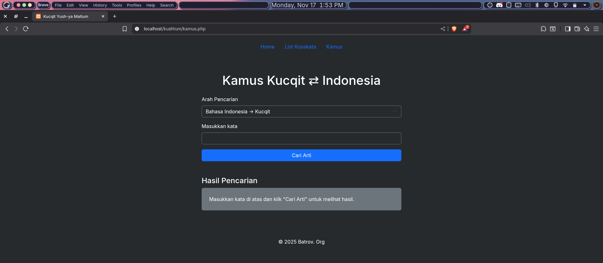

# Database Kosakata Kushtum

**Kushtum** adalah database kosakata Bahasa Kucqit ke Bahasa Indonesia yang bisa diakses secara offline dalam bentuk tabel SQL. Project ini merupakan alternatif offline dari kamus online di [kushtum.fwh.is](https://kushtum.fwh.is).

> **Catatan:** Saat ini database hanya mendukung terjemahan Bahasa Kucqit ke Bahasa Indonesia. Dukungan untuk bahasa lain akan hadir di masa mendatang!

## Fitur

- **Pencarian Offline:** Cari kosakata Bahasa Kucqit kapan saja tanpa koneksi internet.
- **Instalasi Mudah:** Clone repo ini, impor tabel ke SQL lokal, dan gunakan antarmuka web yang sudah disediakan.
- **Update Berkala:** Kosakata akan terus diperbarui—pastikan selalu update repo ini untuk data terbaru!

## Cara Penggunaan

1. **Clone Repository:**
   ```bash
   git clone https://github.com/fogoffaith/kushtum.git
   cd kushtum
   ```
2. **Impor Tabel SQL** ke database lokal kamu (lihat file SQL yang tersedia di repo).
3. **Buka Antarmuka Web:**
   - Jalankan antarmuka web yang ada di repo untuk mencari kosakata.
   - Contoh tampilan antarmuka:
     
     

4. **Selesai!** Kini kamu bisa mencari kosakata Bahasa Kucqit tanpa internet.

## Kenapa Menggunakan Kushtum?

- Praktis dan cepat untuk mencari kosakata Bahasa Kucqit secara offline.
- Cocok untuk pelajar, peneliti, atau siapa pun yang sering butuh akses kamus Bahasa Kucqit.

## Keterbatasan

- Database saat ini **belum mencakup semua kosakata**.
- Update kosakata akan dilakukan secara berkala.

## Kontribusi

Kontribusi terbuka lebar!
- Bisa Nerjemahin ke Bahasa Lain? Silakan open issue atau pull request.
- Mau bantu mengembangkan project ini? Fork, kembangkan, lalu kirim PR.

---

**YEEEEEY! UHIHA!**
